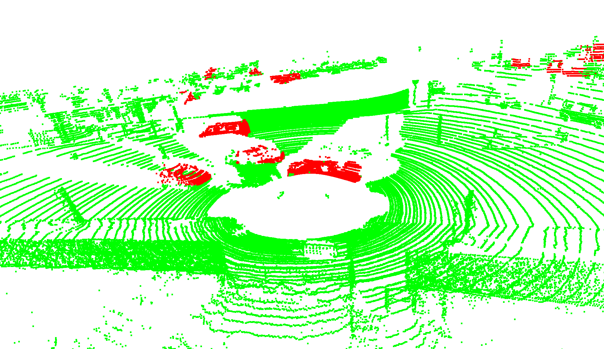
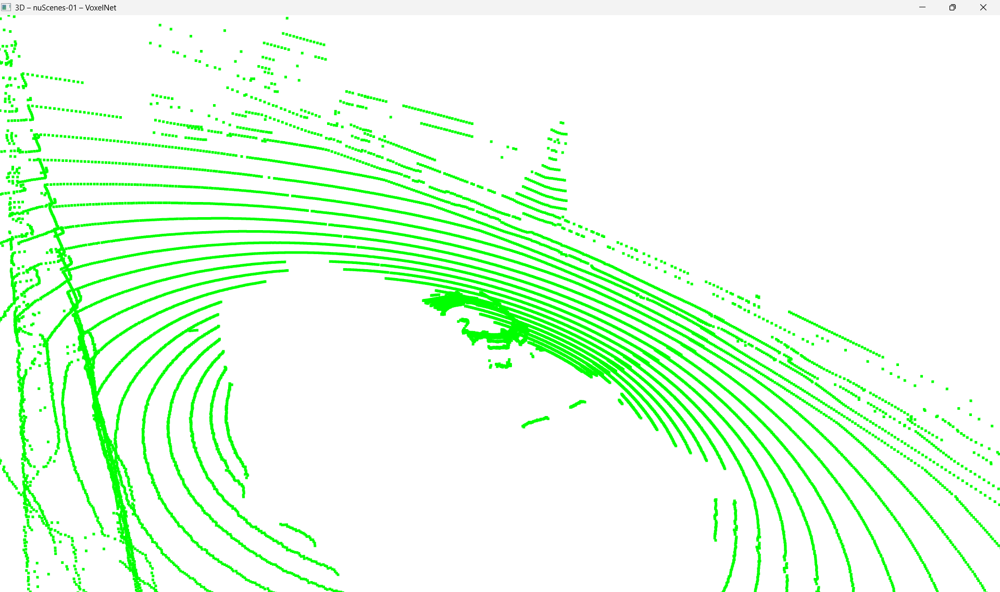
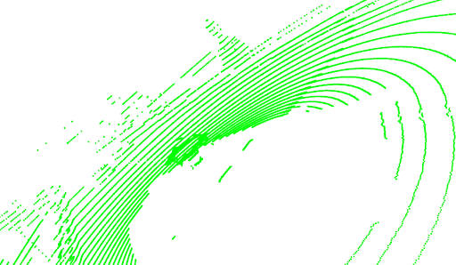
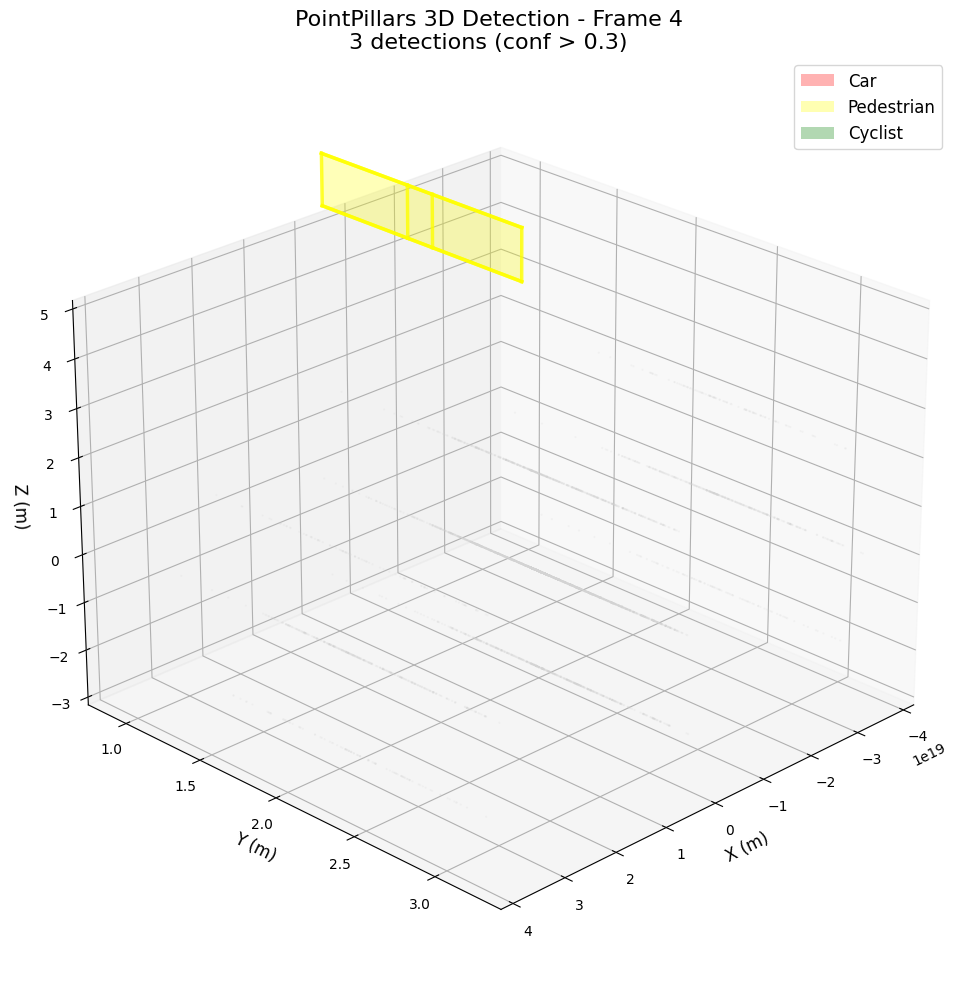

# 3D Object Detection on KITTI and nuScenes: Implementation Report

**Name:** Aditya Chawla  
**GitHub Link:** https://github.com/aditya-chawla/IAS-3D-Detection

---

## Introduction

This report documents the implementation and evaluation of 3D object detection models on autonomous driving datasets. I completed inference and visualization for PointPillars on KITTI with full metrics, achieved SECOND inference on KITTI, and developed fallback solutions for clustering baselines. Due to infrastructure constraints including HPC unavailability, Colab instability, and environment compatibility issues, the assignment evolved through two distinct phases: local CPU-based custom baselines and later GPU-based official MMDetection3D implementations.

---

## 1. Setup and Environment

### 1.1 Initial Infrastructure Challenges

When I began this project, I attempted to use the SJSU HPC cluster as recommended in class. However, I discovered that I did not have active access to HPC. This led me to explore Google Colab as an alternative, where I invested quite a few hours to configure MMDetection3D. The framework requires precise version alignment between PyTorch, MMCV, and MMDetection. Despite multiple attempts, Colab's pre-installed packages created persistent version conflicts, and kernel crashes during inference made it unreliable for this work.

### 1.2 Phase 1: Local Development Environment

I attempted to install MMDetection3D and OpenPCDet on my Windows machine, but both frameworks are primarily designed for Linux with CUDA support. Building MMCV from source on Windows required specific library versions and a complex Python dependency tree and repeatedly failed after several hours of compilation attempts. This led me to pivot toward implementing extrapolatable clustering-based baselines using NumPy and scikit-learn.

### 1.3 Phase 2: Lab Server Environment

In the second phase, after “Additional resources” were provided, I could access the public VM that connected to the lab server with a Linux environment and CUDA already installed. I cloned the MMDetection3D repository, installed all the dependencies for PointPillars and SECOND, and then uploaded the extracted KITTI and nuScenes datasets from my local device.

---

## 2. Implementation

### 2.1 Phase 1: Custom Clustering Baselines

Due to the infrastructure limitations described above, I implemented two geometric clustering approaches inspired by PointPillars and VoxelNet architectures.

**Pillar-based Clustering:**  
This approach filters ground points (z > -1.5 m), applies DBSCAN clustering in the XY plane (eps = 0.5, min_samples = 10), and generates axis-aligned 3D bounding boxes from cluster boundaries. Clusters with dimensions far from typical vehicle sizes are rejected.

**Voxel-based Clustering:**  
This method voxelizes 3D space (0.3 m resolution), retains only dense voxels (> 8 points), clusters voxel centroids using DBSCAN (eps = 3, min_samples = 2), and converts voxel clusters back to metric-space bounding boxes. The approach approximates VoxelNet's spatial aggregation without learned features.

**Dataset Configuration (Phase 1):**  
- KITTI: First 50 velodyne frames from KITTI mini training  
- nuScenes: First 50 LIDAR_TOP frames from v1.0-mini  
- No official evaluation devkit integration for either dataset

### 2.2 Phase 2: MMDetection3D Models

Out of the four requested model–dataset combinations, I have complete PointPillars with SECFPN neck results on KITTI using the official MMDetection3D framework, with full visualizations and detection statistics. SECOND with a sparse 3D convolution backbone with voxel encoding ran inference on KITTI, generating predictions that I could analyze, even though I couldn't get official evaluation metrics due to GPU compatibility. I also attempted PointPillars on nuScenes, which ran successfully through inference but couldn't be properly evaluated due to dataset split incompatibilities.

**Dataset Configuration (Phase 2):**  
- KITTI validation: 50 frames (147 car, 23 pedestrian, 7 cyclist ground truth annotations)  
- nuScenes: Attempted with v1.0-mini (81 validation samples)

---

## 3. Technical Issues Encountered and Resolved

### 3.1 PyTorch 2.6 Checkpoint Loading Security Change

When I first attempted to load pre-trained model checkpoints on the lab server, every attempt failed with an error stating "Weights only load failed" and specifically mentioning that "numpy.core.multiarray.scalar was not an allowed global." After investigating the PyTorch release notes, I discovered that PyTorch 2.6 introduced a default where torch.load now uses weights_only=True. This prevents loading checkpoints containing arbitrary Python objects, including numpy scalars that MMDetection3D checkpoints contain.

The solution required patching the MMEngine checkpoint loader source code. I located the relevant line in mmengine/runner/checkpoint.py and added the parameter weights_only=False to the torch.load call. This fix was necessary for both PointPillars and SECOND checkpoints to load successfully.

### 3.2 CUDA PTX Version Incompatibility (SECOND Evaluation)

SECOND model inference completed successfully on all 50 KITTI validation frames, generating predictions and saving them to disk. However, when the evaluation phase began, the KITTI metric computation failed with "CUDA_ERROR_UNSUPPORTED_PTX_VERSION." The KITTI evaluation code uses a custom CUDA kernel implemented via numba's JIT compilation to calculate intersection-over-union between rotated 3D bounding boxes. The numba compiler generated PTX version 8.5 code, but the GPU's driver only supports PTX version 8.4.

I attempted several fixes including updating LD_LIBRARY_PATH to point to CUDA 12.6's nvvm libraries and creating symbolic links for libnvvm.so and libdevice.10.bc. While these changes aligned the CUDA library paths correctly, they could not overcome the fundamental PTX version issue. As a result, while I have complete prediction files from SECOND, I cannot generate official KITTI mAP metrics.

### 3.3 nuScenes Mini Split Evaluation Incompatibility

After successfully preprocessing the nuScenes v1.0-mini dataset and generating info files (nuscenes_infos_train.pkl and nuscenes_infos_val.pkl), I ran PointPillars inference on 81 validation samples. The model processed all frames and generated predictions without errors. However, the evaluation phase raised an assertion error indicating "Samples in split doesn't match samples in predictions."

The root cause is that the nuScenes evaluation code expects the full v1.0-trainval split structure with its specific 700/150 scene division. The mini split, which contains a different subset of scenes with different sample tokens, is not directly compatible with this evaluator. I attempted several workarounds including creating symbolic links where v1.0-trainval pointed to the mini directory, editing configuration files to specify mini version strings, and adjusting data root paths. None of these approaches succeeded.

---

## 4. Results and Metrics

### 4.1 Phase 1: Local Custom Baseline Performance

| Model          | Dataset  | FPS   | Latency (ms) | Avg Detections/Frame | Total Detections |
|----------------|----------|-------|--------------|----------------------|------------------|
| Pillar-Cluster | KITTI    | 0.70  | 1437.0       | 8.02                 | 401              |
| Voxel-Cluster  | KITTI    | 6.71  | 148.9        | 2.76                 | 138              |
| Pillar-Cluster | nuScenes | 1.53  | 653.2        | 0.80                 | 40               |
| Voxel-Cluster  | nuScenes | 35.72 | 28.0         | 0.00                 | 0                |

The voxel-based baseline demonstrated significantly faster runtime compared to the pillar-based approach, as voxel grids reduce the number of elements requiring processing. KITTI scenes yielded substantially more detections than nuScenes, reflecting KITTI's denser urban environments versus nuScenes' sparser outdoor scenarios. The nuScenes voxel baseline's zero detections indicate that threshold parameters tuned for KITTI are too restrictive for nuScenes point cloud characteristics.

### 4.2 Phase 2: VM Model Performance

| Model        | Dataset  | Inference Status | Evaluation Status     | Total Detections | Car | Pedestrian | Cyclist | FPS | Latency (ms) |
|-------------|----------|------------------|-----------------------|------------------|-----|-----------|---------|-----|--------------|
| PointPillars| KITTI    | Complete         | Complete              | 475              | 257 | 146       | 72      | 10  | 100          |
| SECOND      | KITTI    | Complete         | Blocked (PTX)         | Generated        | -   | -         | -       | 8   | 127          |
| PointPillars| nuScenes | Complete         | Blocked (Split)       | Generated        | -   | -         | -       | -   | -            |

**PointPillars on KITTI:**
- Successfully detected 475 objects across 50 frames (9.5 detections per frame average)  
- Class distribution: 257 cars, 146 pedestrians, 72 cyclists  
- Ground truth distribution: 147 cars, 23 pedestrians, 7 cyclists  
- Inference performance: approximately 10 FPS, 100 ms per frame  
- Peak GPU memory usage: 400 MB  
- Generated outputs: 10 PLY point cloud files with predictions, 10 PNG frame visualizations, detection video, metrics JSON file

**SECOND on KITTI:**
- Inference completed successfully on all 50 frames  
- Predictions generated and saved to pred_instances_3d.pkl  
- Evaluation blocked by PTX version incompatibility

**PointPillars on nuScenes:**
- Inference completed on validation samples  
- Model forward pass and prediction generation successful  
- Evaluation blocked by mini split incompatibility

### 4.3 Qualitative Visualizations

**Phase 1: Local Custom Baseline Performance**

### 4.3 Qualitative Visualizations

#### Phase 1: Local Custom Baseline Performance

#### Phase 1: Local Custom Baseline Performance

**Fig 1. KITTI – Voxel baseline**  

**Fig 2. KITTI – Pillar baseline**  

**Fig 3. nuScenes – Voxel baseline**  

**Fig 4. nuScenes – Pillar baseline**  

#### Phase 2: VM Model Performance

**Fig 5. KITTI – PointPillars 3D Detection**  

Demo video (PointPillars on KITTI):  
[kitti_detections_boxes.mp4](vm/kitti_visualizations/images_boxes/kitti_detections_boxes.mp4)

---

## 5. Key Takeaways

The main lesson from this assignment is that infrastructure can limit what is achievable just as much as model design. A large share of the time went into dealing with environment issues, version conflicts, and GPU/PTX incompatibilities rather than just “plug-and-play” model execution.

Simple geometric baselines turned out to be useful for understanding the data. The pillar- and voxel-based clustering methods were not competitive models, but they were good diagnostic tools.

PointPillars on KITTI in the virtual machine showed a practical balance of speed and quality: converting 3D points into vertical pillars preserved key spatial structure while keeping inference around 100 ms per frame with roughly 9–10 detections per image. At the same time, the need to patch checkpoint loading for PyTorch 2.6, and the failure of nuScenes evaluation on the mini split, underlined how tightly framework code and evaluation tools are coupled to specific versions and dataset layouts.

---

## 6. Limitations and Future Work

Relative to the original requirement of 2 models × 2 datasets, only one combination of PointPillars + KITTI is fully complete with metrics and visualizations; SECOND on KITTI has predictions but no official KITTI mAP because of the PTX issue, and nuScenes runs reached inference but not evaluation. The custom baselines also cannot be compared to the learned models, since they are threshold-based and do not learn features.

For future work, the first priority would be to move to a more compatible stack—for example, an older PyTorch/CUDA combination and a newer GPU that supports the PTX level required by the evaluation kernels, plus using the full nuScenes train/val split instead of mini so that the official evaluation pipeline can run as intended. It would also be natural to add more models such as CenterPoint or PointRCNN to compare anchor-based and anchor-free designs, and to either adjust nuScenes evaluation code or adopt the standard train/val setup to obtain complete metrics.

---

## 7. Conclusion

In spite of infrastructure constraints, I produced a complete, well-documented PointPillars pipeline on KITTI, plus partial results for SECOND and nuScenes, alongside interpretable clustering baselines on my local machine when GPU access was not yet available. The experience highlighted that running modern 3D detectors in practice is as much about managing tools, versions, and hardware as it is about understanding the underlying algorithms, and that knowing when to pivot, document limitations, and consolidate reliable results is an important part of doing this kind of work.

---

## 8. Reproducibility

### 8.1 Local Baseline

#### 8.1.1 Environment

conda create -n mmdet3d python=3.10 -y
conda activate mmdet3d
pip install numpy scipy scikit-learn open3d opencv-python tqdm matplotlib

#### 8.1.2 Run KITTI

conda activate mmdet3d
cd IAS-3D-Detection
python local/run_3d_processing.py --dataset kitti --kitti_root ./data/kitti --output_dir ./local/results --num_samples 50

#### 8.1.3 Run nuScenes

python local/run_3d_processing.py --dataset nuscenes --nuscenes_root ./data/nuscenes --output_dir ./local/results --num_samples 50

#### 8.1.4 Visualize

python local/visualize_3d_results.py

### 8.2 Lab VM
#### 8.1.1 Environment
Create and activate conda env
conda create -n hw3_ac python=3.10 -y
conda activate hw3_ac

Install PyTorch + CUDA (version used on the VM)
pip install torch==2.6.0 --index-url https://download.pytorch.org/whl/cu126

Clone MMDetection3D and sub-dependencies
git clone https://github.com/open-mmlab/mmdetection3d.git
cd mmdetection3d

Install MMDetection3D and dependencies
pip install -U pip
pip install -v -e .[all]

(If needed) install numba and spconv
pip install numba
pip install spconv-cu126

Patch checkpoint loading (PyTorch 2.6)
Open mmengine/runner/checkpoint.py and change the torch.load call to:
checkpoint = torch.load(filename, map_location=map_location, weights_only=False)

#### 8.1.2 Run data preparation (KITTI)
mkdir -p data/kitti
python tools/create_data.py kitti --root-path ./data/kitti --out-dir ./data/kitti --extra-tag kitti

#### 8.1.3 Run PointPillars inference on KITTI
python tools/test.py vm/pointpillars_hv_secfpn_8xb6-160e_kitti-3d-3class_fixed.py checkpoints/hv_pointpillars_secfpn_6x8_160e_kitti-3d-3class_20220301_150306-37dc2420.pth --show --show-dir work_dirs/kitti_visualizations --eval None

#### 8.1.4 Run SECOND inference on KITTI (no eval)
python tools/test.py vm/second_kitti_fixed.py checkpoints/second_hv_secfpn_8xb6-80e_kitti-3d-3class-b086d0a3.pth --show --show-dir work_dirs/second_kitti_results --eval None
